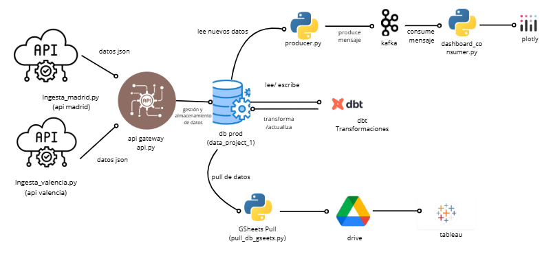

# **💨 DATA PROJECT I: Sistema de Monitorización de la Calidad del Aire**

**Máster en Big Data & Cloud 2025-2026**
**Tutor**: Pedro Nieto. 
**Participantes**: Daniel Adam, Gemma Balaguer, Pau Garcia. 

## **1. INTORDUCCIÓN**
El presente proyecto desarrolla un pipeline de datos integral orientado a la monitorización en tiempo real de la calidad del aire en las ciudades de Madrid y Valencia. La solución implementada aborda todas las fases del ciclo de vida del dato: ingesta, estandarización, almacenamiento, transformación, streaming, visualización y distribución hacia herramientas de análisis avanzado.

El diseño propuesto responde a la necesidad de disponer de sistemas automatizados, fiables y escalables que permitan emitir alertas inmediatas a la población y proporcionar información detallada a organismos de gestión y toma de decisiones. Para ello, se ha construido una arquitectura modular apoyada en tecnologías ampliamente adoptadas en entornos de datos modernos.

## **2. Stack Tecnológico.**

**Ingesta** -> Python -> Obtención de datos desde APIs oficiales y procesamiento. 

**Almacenamiento** -> PostgreSQL -> Base de datos relacional para datos brutos y modelos analíticos. 

**Transformación** -> dbt -> Construcción de modelos, liempieza y generación de data marts. 

**Procesamiento en Tiempo real** -> Kafka -> publicación y consumo de eventos para alertas instantáneas.

**Visualización** -> Plotly/Tableau ->  Dashboards operativos y analíticos para distintos perfiles de usuario.

**Orquestación** - > Docker Compose -> Gestión y despliegue reproducible de todos los servicios.

## **3.ARQUITECTURA DEL PROYECTO**


La arquitectura integra múltiples componentes coordinados para garantizar un flujo de datos robusto y automatizado. Se detallan a continuación sus principales etapas.

#### **3.1. Ingesta de Datos**

La carpeta /ingestas contiene los scripts ingesta_madrid.py e ingesta_valencia.py, responsables de:

- Conectarse a las APIs oficiales de ambos ayuntamientos.

- Descargar los datos de calidad del aire en formato JSON.

- Realizar las transformaciones necesarias para estandarizar las estructuras.

- Enviar los datos procesados a una API interna mediante solicitudes HTTP POST.

Esta capa permite aislar la lógica específica de cada proveedor de datos, manteniendo un diseño modular y extensible.

#### **3.2. API Gateway**

El archivo api.py actúa como punto de entrada único al sistema. Su función es:

- Validar el contenido recibido desde los scripts de ingesta.

- Homogeneizar la información independientemente del origen.

- Insertar los datos en la base de datos relacional.

Esta estrategia evita la conexión directa de múltiples componentes a la base de datos y facilita la gobernanza del sistema.

#### **3.3. Almacenamiento en PostgeSQL**

La base de datos data_project_1 constituye el repositorio central del pipeline.
Almacena:

- Datos crudos (raw layer) procedentes de la API.

- Modelos transformados y tablas analíticas creadas mediante dbt.

Su naturaleza relacional permite un control estructurado y un acceso eficiente para las capas posteriores.

#### **3.4. Transformación con dbt**

El proyecto dbt ejecuta las transformaciones necesarias para:

- Limpiar y normalizar las mediciones.

- Generar métricas y agregaciones relevantes.

- Construir la capa final de data marts destinada a herramientas de análisis.

dbt garantiza reproducibilidad, control de versiones e integración directa con PostgreSQL.

#### **3.5. Procesamiento en Tiempo Real con KAFKA**

El ecosistema Kafka se compone de:

Producer (producer.py): consulta periódicamente la base de datos y publica nuevos registros en un topic dedicado.

- Consumer (dashboard_consumer.py): consume los mensajes recibidos y actualiza un dashboard operativo en Plotly, permitiendo visualizar alertas prácticamente en tiempo real.

- Este componente habilita la comunicación asíncrona entre sistemas y permite escalar la arquitectura con múltiples consumidores especializados.

#### **3.6. Entrega Herramientas de BI**

Dado que Tableau no accede directamente a PostgreSQL en este entorno, el script pull_db_gsheets.py exporta los modelos finales a Google Sheets. Tableau consume estas hojas para generar dashboards de análisis avanzado dirigidos a perfiles expertos.

## **4. Ejecución del Proyecto**

El despliegue completo se realiza mediante Docker, lo que garantiza reproducibilidad y facilita la puesta en marcha del ecosistema.

#### **4.1. Requisitos previos**

1. Docker Engine o Docker Desktop instalado.

2. Docker Compose operativo.

3. Archivo .env configurado (si corresponde).

#### **4.2. Inicio del sistema**

Para desplegar todos los servicios (PostgreSQL, Kafka, API, dbt, dashboards, etc.) se utiliza el siguiente comando:

``` sh
docker compose up -d

```
Este proceso construye las imágenes necesarias, levanta los contenedores y activa los flujos de ingesta, transformación y procesamiento en tiempo real.

#### **4.2. Verificación del estado de los servicios**
Permite comprobar que todos los contenedores se encuentran en ejecución y en estado saludable.

```sh
docker compose ps
```
#### **4.3. Monitorización de los dashboards.**

- Alertas en tiempo real (Plotly)

Interfaz destinada a simular la visualización que tendría un usuario final (ciudadanía).
Acceso desde el navegador:

👉 http://localhost:8050

- Dashboards en tableau.
Acceso del usuario: 

👉  https://public.tableau.com/app/profile/daniel.adam5716/viz/CalidadAireDP_varias/Alertas

## **4. Origen de Datos y Flujo de Entrega**

#### **4.1. Origen de Datos**

**Calidad del Aire-Tiempo real** - > API Ayuntamiento de Madrid -> https://ciudadesabiertas.madrid.es/dynamicAPI/API/query/calair_tiemporeal.json?pageSize=5000

**Estaciones de Contaminación Atmosférica** ->API Ayuntamiento de Valencia ->https://valencia.opendatasoft.com/api/records/1.0/search/?dataset=estacions-contaminacio-atmosferiques-estaciones-contaminacion-atmosfericas&rows=1000


Ambas fuentes proporcionan datos fiables, auditables y con garantías institucionales, requisito esencial para un sistema que puede ser utilizado en un contexto de salud pública.

#### 4.2. Estructura del Repositorio y Rol de Cada Componente

Este documento describe la organización del repositorio y la función específica de cada carpeta y archivo dentro de la arquitectura general del proyecto.

---

## 🏗️ Componentes de la Arquitectura

| Carpeta / Archivo | Rol en la Arquitectura | Descripción |
| :--- | :--- | :--- |
| **README.md** | **Documentación General** | Proporciona una visión general del proyecto, la arquitectura utilizada y los pasos detallados para la instalación y ejecución del sistema. Es el punto de partida para cualquier usuario o desarrollador. |
| **requirements.txt** | **Dependencias Python** | Contiene la lista de librerías y paquetes de Python necesarios para asegurar un entorno de ejecución reproducible. Se utiliza para instalar todas las dependencias del proyecto. |
| **docker-compose.yml** | **Infraestructura** | Archivo clave para la orquestación. Define y configura los servicios de la infraestructura como **Kafka**, **Zookeeper**, **PostgreSQL**, la **API**, **dbt** y otros scripts asociados, permitiendo desplegar todo el entorno con un solo comando. |
| **`/ingestas`** | **Ingesta de Datos** | Carpeta que alberga los scripts de Python encargados de la **conexión y extracción de datos** desde las APIs oficiales de origen (actualmente Madrid y Valencia). Son los responsables de alimentar el *pipeline* de datos. |
| **`/kafka`** | **Streaming** | Contiene los archivos de configuración y *settings* necesarios para el correcto funcionamiento de los brokers de **Kafka** y el servicio de coordinación de **Zookeeper**. |
| **`producer.py` / `dashboard_consumer.py`** | **Procesamiento en Tiempo Real** | Scripts esenciales para el sistema de alertas: **`producer.py`** es el encargado de enviar mensajes (datos) a los *topics* de Kafka, y **`dashboard_consumer.py`** los consume para generar y gestionar las alertas en tiempo real. |
| **`/dbt/models`** | **Transformación (ELT)** | Aquí reside la lógica de **Modelado SQL** utilizando la herramienta **dbt (data build tool)**. Los modelos están organizados por etapas: `staging` (limpieza inicial), `intermediate` (lógica de negocio) y `marts` (tablas finales optimizadas para el consumo). |
| **`pull_db_gsheets.py`** | **Reverse ETL** | Script de automatización para la **exportación de datos** limpios y transformados (generalmente desde los *marts* de PostgreSQL) hacia **Google Sheets**. Esto facilita el análisis posterior y la visualización en herramientas como Tableau. |

---

## 🚀 Flujo General (Concepto)

El repositorio está diseñado para un **flujo de datos *end-to-end***:

1.  **Ingesta:** Scripts en `/ingestas` extraen datos de APIs.
2.  **Streaming/Real-Time:** Los datos se publican en Kafka (`producer.py`) y se monitorean (`dashboard_consumer.py`).
3.  **Almacenamiento:** Los datos persisten en **PostgreSQL**.
4.  **Transformación:** **dbt** (`/dbt/models`) transforma los datos crudos en modelos listos para el análisis.
5.  **Reverse ETL:** El script `pull_db_gsheets.py` exporta los resultados finales para la visualización de negocio.


## **5. Modelo y Visualización de Datos**

El proyecto se sustenta en una doble capa de visualización para cubrir tanto la monitorización en tiempo real como el análisis histórico.

#### **5.1. ⚡ Visualización de Datos a Tiempo Real (Plotly/Dash)**

El dashboard opera a baja latencia, leyendo directamente desde Kafka.

##### Finalidad del Dashboard

* **Alertas inmediatas:** Notificación visual con Semáforo (Rojo/Verde) al superar los límites de contaminación.
* **Análisis Rápido:** Uso de Gráfico Radar para identificar el contaminante responsable de la alerta.

##### Lógica Central de Alerta

La clasificación se basa en la comparación con los límites de la OMS o normativa local (en $\mu \text{g}/\text{m}^3$):

$$
\text{LIMITES} = \{
    \text{"NO}_2\text{": 40 (Diaria)}, 
    \text{"O}_3\text{": 100 (Horaria)}, 
    \text{"PM}10\text{": 50 (Diaria)}, 
    \text{"PM}2.5\text{": 25 (Diaria)}
\}
$$

| Nivel | Rango (%) Respecto al Límite | Color | Alerta |
| :--- | :--- | :--- | :--- |
| **Bajo** | $< 50\%$ | Verde | ✅ AIRE LIMPIO |
| **Medio** | $50\%$ a $100\%$ | Amarillo | ⚠️ PRECAUCIÓN |
| **Alto** | $> 100\%$ | Rojo | 🚨 ALERTA |

##### Cálculos Clave
* **Normalización (Saturación):** $\left( \frac{\text{Valor Actual}}{\text{Límite Legal}} \right) \times 100$.
* **Gráfico Radar:** Usa el porcentaje de saturación (hasta un máximo de 150%) para dibujar el polígono. Si cualquier gas supera el $100\%$, el polígono completo se colorea de rojo.

#### **5.2. 📈 Visualización de Datos con Tableau**

**Acceso:** [CalidadAireDP_varias | Tableau Public](https://public.tableau.com/app/profile/pablo.garcia4815/vizes/CalidadAireDP_varias/VisinGlobal-Alertas)

La visualización en Tableau se centra en el análisis de negocio e histórico a partir de los datos modelados.

##### 1. VISIÓN GLOBAL - ALERTAS
* **Propósito:** Mostrar la situación actual y las alertas activas en las estaciones.
* **Controles:** Filtro de **Ciudad** y umbrales de alerta ajustables por el usuario.
* **Mapa:** Código de color (Verde/Rojo) basado en la activación de alertas por estación.

##### 2. VISIÓN AL DETALLE - GASES/PARTÍCULAS
* **Propósito:** Análisis específico de un contaminante seleccionado.
* **Tendencia de 5 horas:** Muestra la evolución reciente (series temporales) para identificar subidas o bajadas rápidas.
* **Anomalías (Gráfico de Barras):** Compara la última medición con el promedio de la última hora.
    * **Barra Roja (+):** La contaminación está subiendo (pico o anomalía).

##### 3. VISTA DE HISTÓRICOS
* **Propósito:** Analizar la evolución a largo plazo (anual y mensual) de la concentración de gases.
* **Filtros:** **Gas**, **Rango de Fechas** y **Estación**.
* **Nota:** Los datos históricos de Valencia finalizan en 2022 debido a la disponibilidad de la API.

##### 4. ESTACIONES OFFLINE - SIN ENVIAR DATOS
* **Propósito:** Monitorizar la salud operativa de las estaciones.
* **Funcionalidad:** Muestra una lista de estaciones que no han enviado datos en un período definido por el parámetro "Umbral de horas offline", indicando la **Máx. Fecha Carga** y las **Horas offline** transcurridas.